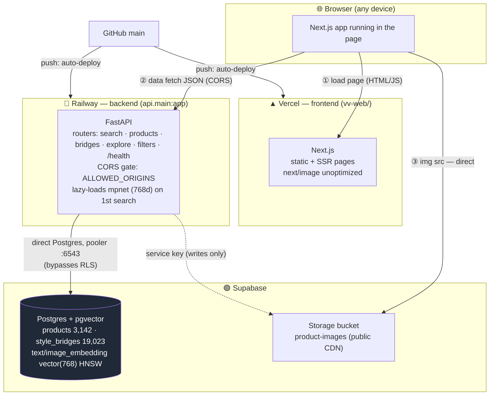
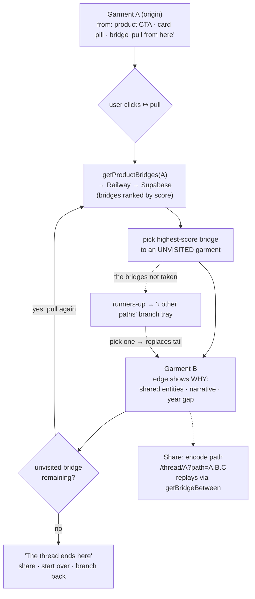
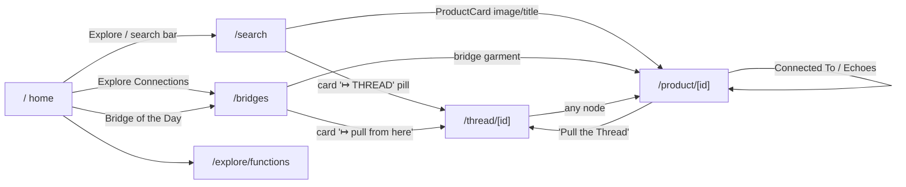

# Vintage Vestige — System Architecture

Grounded in the live code (`api/main.py`, `vv-web/src/lib/api.ts`, the route tree). Last verified 2026-06-26.
Diagrams are Mermaid — they render graphically on GitHub and in most IDE markdown previews.

---

## 0. System architecture (Mermaid)



---

## 1. System architecture — who hosts what, who talks to whom

```
                                    ┌─────────────────────────────┐
                                    │            BROWSER          │
                                    │   (visitor on any device)   │
                                    └──────────────┬──────────────┘
                                                   │  HTTPS
                       ┌───────────────────────────┴───────────────────────────┐
                       │                                                        │
              ① page loads (HTML/JS)                              ② data fetches (JSON, CORS)
                       │                                                        │
                       ▼                                                        ▼
   ┌─────────────────────────────────────┐               ┌─────────────────────────────────────┐
   │             VERCEL                   │               │             RAILWAY                  │
   │   Next.js frontend  (vv-web/)        │               │   FastAPI backend  (api.main:app)    │
   │                                      │               │                                      │
   │  • Static + server-rendered pages    │               │  Routers (api/routers/):             │
   │  • Reads NEXT_PUBLIC_API_URL ────────┼──────────────▶│   /search   /products   /bridges     │
   │  • next/image  unoptimized:true      │   calls the   │   /explore  /filters    /health      │
   │  • domains: vintagevestige.com,      │   Railway API │                                      │
   │    *.vercel.app                      │               │  CORS: ALLOWED_ORIGINS (env) gates   │
   └──────────────────┬───────────────────┘               │  which browser origins may call it   │
                      │                                    │                                      │
       images load DIRECTLY from Supabase                  │  Lazy-loads embedding model on 1st   │
       (unoptimized → browser ⇒ Supabase CDN)              │  search (all-mpnet-base-v2, 768d)    │
                      │                                    └──────────────────┬───────────────────┘
                      │                                                       │
                      │                                          direct Postgres (DATABASE_URL,
                      │                                          pooler :6543, bypasses RLS)
                      ▼                                                       ▼
   ┌──────────────────────────────────────────────────────────────────────────────────────────┐
   │                                      SUPABASE                                              │
   │                                                                                            │
   │   Postgres + pgvector                       Storage bucket: product-images                 │
   │   • products (3,142 rows)                   • public image URLs                            │
   │     - text_embedding vector(768) HNSW       • served via Supabase CDN                      │
   │     - image_embedding vector(768) HNSW        (the browser fetches these directly)         │
   │   • style_bridges (19,023 rows)                                                            │
   └──────────────────────────────────────────────────────────────────────────────────────────┘

   Build/deploy: GitHub `main` ──push──▶ Vercel (frontend) + Railway (backend) auto-redeploy.
```

**Three independent network hops the browser makes:**
1. **Browser → Vercel** — loads the page (HTML/JS). Vercel serves the Next.js app.
2. **Browser → Railway** — the page's JS calls the API for data (search, product, bridges). Gated by **CORS** (`ALLOWED_ORIGINS`).
3. **Browser → Supabase Storage** — `` tags load product images *directly* from Supabase's CDN (because `next/image` is `unoptimized`, Vercel's optimizer is bypassed).

**Two server-side hops (no browser involved):**
- **Railway → Supabase Postgres** — the API queries `products`/`style_bridges` over the pooler (`:6543`) using `DATABASE_URL`. This is a **direct Postgres connection → bypasses RLS** (the app has full DB access; RLS state is irrelevant to it).
- **Railway → Supabase Storage** — only when generating/managing images (service key); not on the read path for visitors.

**Why each piece is where it is:**
- **Vercel** hosts the frontend because Next.js + Vercel is the smoothest path; static pages + ISR are cheap and fast.
- **Railway** hosts the API because it carries the heavy Python deps (torch, sentence-transformers) and needs a long-running server to keep the embedding model warm in memory.
- **Supabase** is the single source of truth: relational data + vector search (pgvector, no separate vector DB) + image hosting, all in one.

---

## 2. The request lifecycle (a single text search, end to end)

```
User types "silk dress", hits Enter on  vintagevestige.com/search
        │
        ▼
[Browser]  fetch POST  {NEXT_PUBLIC_API_URL}/search/text   { query, limit }
        │                    (Origin: https://vintagevestige.com)
        ▼
[Railway / FastAPI]  CORS check: is this Origin in ALLOWED_ORIGINS?  ── no ──▶ ❌ browser blocks (search "fails")
        │ yes
        ▼
  search_text():
    1. emb.generate_text_embedding(query)   ← lazy-loads mpnet on 1st call (~33s cold, ~0.02s warm)
    2. vs.search_text(vector, limit)         ← pgvector cosine query, HNSW index (~0.2s)
        │
        ▼ direct Postgres (pooler :6543)
[Supabase]  ORDER BY text_embedding <=> :vec  LIMIT n   → top matches
        │
        ▼
[Railway]  returns JSON { results:[…], query, total }
        │
        ▼
[Browser]  renders ProductCard grid;  each card's  ─────▶ [Supabase Storage] loads image directly
```

---

## 3. Frontend interactions — routes & the calls they make

Every page is a thin client: it renders, then calls the Railway API via `vv-web/src/lib/api.ts`.

| Route | What the user does | API calls it makes |
|---|---|---|
| `/` (home) | Hero, "Explore Connections" CTA → `/bridges`, Bridge of the Day | `getTopBridges` (featured) |
| `/search` | Type query, Enter/Search → results grid | `searchByText` → `POST /search/text` |
| `/product/[id]` | View a garment: image, metadata, "Pull the Thread", connected bridges | `getProduct`, `getProductBridges`, `getStyleAncestry`, `getStyleSiblings` |
| `/bridges` | Browse all connections, filter by type/crossing/score | `getTopBridges`, `getBridgeStats` |
| `/thread/[id]` | **Thread Pull** — walk the graph garment→garment | `getProductBridges` (each pull), `getBridgeBetween` (share-link replay) |
| `/explore/functions` + `/[function]` | Browse by social function | `getExploreFunctions`, `getExploreFunction` |
| `/about` | Static | none |

### Signature interaction — Thread Pull (client-side graph walk)

```
        ┌──────────────┐
        │  Garment A   │  ← origin (from a product's "Pull the Thread",
        └──────┬───────┘     a card pill, or a bridge's "pull from here")
               │  user clicks "↦ pull"
               ▼
   getProductBridges(A) ──▶ Railway ──▶ Supabase  (A's bridges, ranked by score)
               │
        pick highest-score bridge to an UNVISITED garment   ──▶ runners-up fill the "› other paths" branch tray
               ▼
        ┌──────────────┐
        │  Garment B   │   edge shows WHY (shared entities, narrative, year gap)
        └──────┬───────┘
               │  repeat (visitedIds set prevents loops)
               ▼
        ┌──────────────┐
        │  Garment C   │  … until no unvisited bridge → graceful "thread ends here"
        └──────────────┘

   Branch:   pick a runner-up  → replaces the tail below, continues down that path
   Share:    encode path as /thread/A?path=A.B.C  → replays client-side via getBridgeBetween
   Entry from a bridge pair:  /thread/{source}?path={source}.{target}  (respects lineage direction)
```

### Thread Pull flow (Mermaid)



### How a click navigates — link graph (Mermaid)



### How a click navigates (the link graph, text)

```
  home ──"Explore Connections"──▶ /bridges ──card "↦ pull"──▶ /thread/{src}?path=src.tgt
   │                                  │
   └──"Explore"(search)──▶ /search ──ProductCard──▶ /product/[id] ──"Pull the Thread"──▶ /thread/[id]
                              │            └──card "↦ THREAD" pill──────────────────────▶ /thread/[id]
                              └──result image/title──▶ /product/[id]
```

---

## 4. What to add in Railway settings

The backend needs these to run and to be reachable. Set under **your service → Variables** (env vars) and **Settings** (the rest).

### Environment variables (Settings → Variables)
| Var | Value | Why |
|---|---|---|
| `DATABASE_URL` | Supabase **pooler** URL, port **6543** (`postgresql+psycopg://…pooler.supabase.com:6543/postgres`) | API queries Postgres/pgvector |
| `SUPABASE_URL` | from `.env` | image storage helper |
| `SUPABASE_SERVICE_KEY` | from `.env` | storage access (bypasses RLS) |
| `SUPABASE_STORAGE_BUCKET` | `product-images` | which bucket |
| **`ALLOWED_ORIGINS`** | **`https://vintagevestige.com,https://www.vintagevestige.com,https://vintage-vestige-git-main-jenkcs-projects.vercel.app,http://localhost:3000`** | **CORS** — which browser origins may call the API. **No spaces after commas.** ← **this is the one still missing for the custom domain** |
| ~~`PORT`~~ | **do NOT set** | Railway injects `$PORT`; setting it manually breaks routing |

> `ANTHROPIC_API_KEY` is **not** needed to serve search — only for enrichment scripts.

### Settings (one-time)
| Setting | Value |
|---|---|
| Root Directory | `/` (repo root — `api/` + `requirements.txt` live there) |
| Start command | from the repo `Procfile`: `web: uvicorn api.main:app --host 0.0.0.0 --port $PORT` |
| Networking | Generate a public domain (you have `web-production-1d00f.up.railway.app`) |

### The action you still need to take
**Update `ALLOWED_ORIGINS`** to include `https://vintagevestige.com` (and `www`). Until you do, the site loads on the custom domain but **every API call is CORS-blocked** → search returns nothing and image-bearing data never arrives. After saving, Railway auto-redeploys — wait for "Active," then it works.

*(Optional, recommended later): a keep-warm pinger hitting `/search/text` every ~5 min so the embedding model never goes cold — eliminates the ~33s first-search penalty.)*
```
